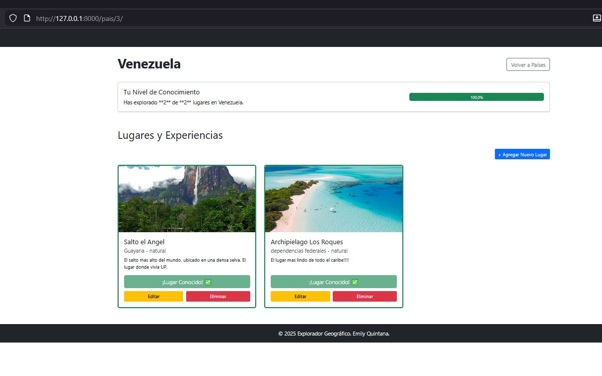

# Explorador Geográfico 🌏

Explorador Geográfico es una aplicación web desarrollada en Django que permite a los usuarios llevar un registro de sus viajes y experiencias. La plataforma combina la exploración de países con una **lógica de gamificación**, calculando automáticamente el porcentaje de conocimiento que un usuario tiene sobre un país en base a los lugares que ha visitado.

Usuarios y administradores interactúan con la aplicación según sus permisos: los usuarios registran sus visitas y los administradores (staff) gestionan el contenido mediante un sistema CRUD protegido.



---

## 🌟 Características Principales

- **Sistema de Progreso:** Cálculo automático del porcentaje de conocimiento por país (lógica de negocio personalizada).
- **Gestión de Contenido (CRUD):** Creación, edición y eliminación de lugares (solo para staff).
- **Exploración Visual:** Listado de países y detalles de lugares con imágenes y descripciones.
- **Autenticación Completa:** Registro, inicio de sesión y cierre de sesión de usuarios.
- **Feedback al Usuario:** Mensajes de éxito y error utilizando alertas de Bootstrap.
- **Control de Acceso:** Páginas de error 403 y 404 personalizadas para una mejor experiencia de usuario.
- **Interfaz Responsiva:** Diseño adaptable utilizando Bootstrap 5.

---

## 📁 Estructura del Proyecto

```bash
.
├─ manage.py
├─ explorador_geografico/  # Configuración del proyecto
│  ├─ settings.py          # Configuración (BD, Apps, Media)
│  ├─ urls.py              # Rutas principales
│  └─ wsgi.py
├─ geografia/              # App principal
│  ├─ models.py            # Modelos (Pais, Lugar, Conocimiento)
│  ├─ views.py             # Lógica (Cálculo %, CRUD, Auth)
│  ├─ forms.py             # Formularios personalizados
│  ├─ urls.py              # Rutas de la app
│  ├─ admin.py             # Configuración del panel admin
│  └─ templates/geografia/ # Plantillas específicas (detalle, listas)
├─ templates/              # Templates globales (base, login, registro)
└─ media/                  # Imágenes subidas por los usuarios

Tecnologías Utilizadas
Python 3.12 – Lenguaje principal de programación.

Django 5.2 – Framework web de alto nivel.

HTML5 / CSS3 / Bootstrap 5 – Para el diseño frontend y componentes visuales (barras de progreso, cards).

Pillow – Librería para el manejo de campos de imagen (ImageField).

PyMySQL – Cliente para conectar Django con bases de datos MySQL.

JavaScript – Integración básica con Bootstrap.

🔹 Por qué Django
Django es un framework web basado en Python para aplicaciones rápidas, seguras y escalables. Sus principales ventajas en este proyecto son:

Arquitectura MVT (Model-View-Template): Facilita la separación entre los datos geográficos, la lógica de porcentajes y la presentación visual.

ORM integrado: Permite gestionar las relaciones entre Usuario, Pais y Lugar sin escribir SQL.

Seguridad incorporada: Manejo seguro de contraseñas y protección contra ataques comunes.

Django Admin: Panel listo para usar que facilita la carga inicial de países y lugares.

Escalabilidad: Estructura modular preparada para agregar más funciones (ej. mapas interactivos).

Tecnologías Utilizadas
Python 3.12 – Lenguaje principal de programación.

Django 5.2 – Framework web de alto nivel.

HTML5 / CSS3 / Bootstrap 5 – Para el diseño frontend y componentes visuales (barras de progreso, cards).

Pillow – Librería para el manejo de campos de imagen (ImageField).

PyMySQL – Cliente para conectar Django con bases de datos MySQL.

JavaScript – Integración básica con Bootstrap.

🧱 Modelos y Formularios
Modelos Principales (models.py)
El proyecto se basa en la relación entre países, lugares y el conocimiento del usuario:

class Pais(models.Model):
    nombre = models.CharField(max_length=100, unique=True)

class Lugar(models.Model):
    pais = models.ForeignKey(Pais, on_delete=models.CASCADE, related_name='lugares')
    nombre = models.CharField(max_length=100)
    imagen = models.ImageField(upload_to='lugares/', blank=True, null=True)
    # ... otros campos ...

class Conocimiento(models.Model):
    usuario = models.ForeignKey(User, on_delete=models.CASCADE)
    lugar = models.ForeignKey(Lugar, on_delete=models.CASCADE)
    fecha_conocido = models.DateTimeField(auto_now_add=True)
    
    class Meta:
        unique_together = ('usuario', 'lugar') # Evita duplicados


🔐 Autenticación y Permisos
Usuarios Generales: Pueden registrarse, iniciar sesión y marcar lugares como "conocidos".

Staff / Administradores: Tienen acceso exclusivo a las vistas de creación, edición y eliminación de lugares.

Protección: Uso de decoradores @login_required y validación user.is_staff en las vistas críticas.

Redirección Inteligente: Configuración de LOGIN_URL y LOGIN_REDIRECT_URL para un flujo de usuario fluido.

🚀 Cómo Ejecutar el Proyecto

1. Crear entorno virtual
python -m venv myven

2. Activar entorno virtual
Windows: myven\Scripts\activate

Mac/Linux: source venv/bin/activate

3. Instalar dependencias
Bash

pip install django pymysql pillow
4. Configurar Base de Datos
Asegúrate de tener MySQL corriendo y crea una base de datos llamada geografia_db. Verifica las credenciales en settings.py.

5. Aplicar migraciones
Bash

python manage.py makemigrations
python manage.py migrate
6. Crear superusuario (Admin)
Bash

python manage.py createsuperuser
7. Ejecutar servidor
Bash

python manage.py runserver
Accede a http://127.0.0.1:8000/ para comenzar a explorar.

📝 Licencia
Este proyecto fue desarrollado como parte de la evaluación del Portafolio de Título.